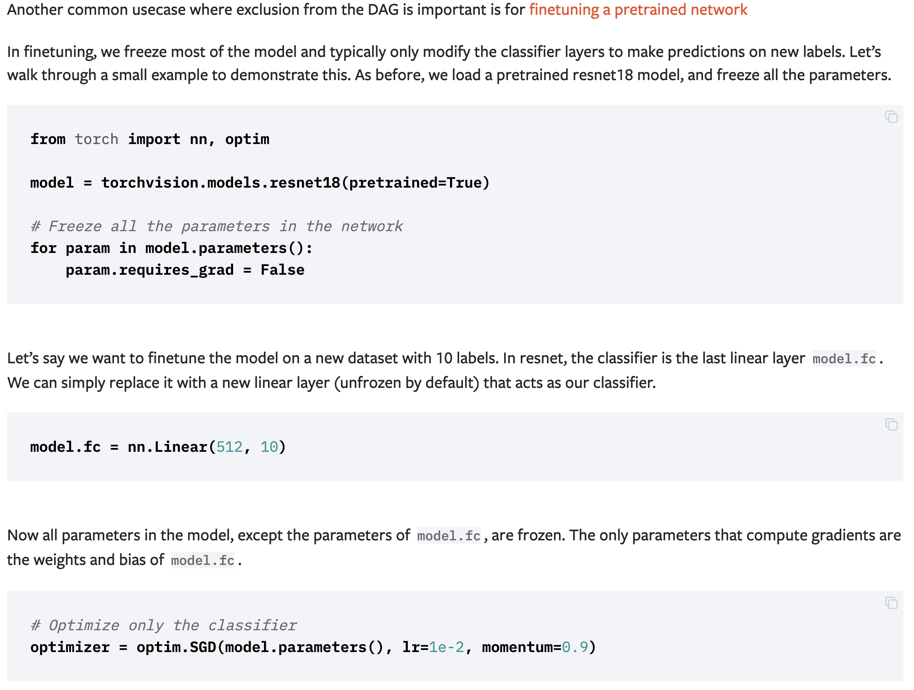

5.20组会：
1. mnist只给偶数样本，要求区分奇偶样本；GAN中有错误样本（人脸中混入了狗脸）能否生成人脸的类似问题调研。min-max：最大化不同类间距离，最小化样本内距离。使得类内点距离尽可能大以防止坍塌——可以产生loss函数。关键词：positive unlabeled learning, open set recognition
2. Resnet：更适合分类问题，可以使得网络层次更深。

wait to do：
看PU Learning, Confident Learning，Open Set Recognition论文。
程序`test_ml_select.py`需要添加的部分：
1. 手写Resnet（现在调的pytorch torchvision的res50）
1. 数据换成7W个几乎正确的数据
1. tensor to gpu，目前的网络虽然在gpu上跑但还不是gpu版本的
1. print不同class的正确率
1. 调参的时候：把中间的特征图print出来
1. batch size, learning rate, optimizer的选取，做一种参数对应一张折线图的可视化


- 采用真正的k-fold：random split成10份，每次取9份作为training data，1份作为test data，重新训练，最后报告10次的average train loss, average test loss，平均正确率。——适合小数据集
- numpy数组可以搞各种索引，下标、切片、省略号、tuple、boolean array、index array都可以当索引。如果是boolean array的话就相当于mask，取boolean array做index之后会把True的位置全部取出来。比如a = np.array([1, 2, 3])，mask = [True, False, True]，a[mask]就是[1, 3]。但如果是index array的话，就会在各个index上取东西出来。a[mask] == [a[1], a[0], a[1]] = [2, 1, 2]，比如a = np.array([1, 2, 3])，mask = [1, 0, 1]，a[mask]就是[2, 1, 2]。这些操作内部肯定都是用C或者Fortran内核写出来的，快。https://numpy.org/doc/stable/reference/arrays.indexing.html。https://numpy.org/doc/stable/reference/arrays.indexing.html。
- 交叉验证只是检验你当前的模型的好坏，比如你有一个逻辑回归模型，当前的正则化系数c是0.1(超参数)，在你的数据集上进行交叉验证，最后分类准确率是80%；此时，你将c调到0.2（没调整一次超参数，你都得到一个“潜在的”新模型）,你再次基于这次调整，在你的数据集上进行交叉 验证，发现你这个模型的的准确率提升到了81%;你再次将c调到0.3,验证结果为79%。所以，你最终确定逻辑回归的参数c=0.2，然后将所有数据丢进去训练，这个模型就是你最终的模型。
交叉验证是将数据随机分为：训练集和测试集。然后这个训练集被进一步细分为两个不相交的子集（这个过程中涉及到划分为几折）：训练子集和验证子集。用训练子集的数据先训练模型，然后用验证子集去跑一遍，看验证集的损失函数、分类准确率等参数。等模型训练好之后，用测试集再去测试模型的性能。
- Tensor.item() → number: Returns the value of this tensor as a standard Python number. This only works for tensors with one element. 
- torch.nn.Conv2d(in_channels, out_channels, kernel_size, stride=1, padding=0, dilation=1, groups=1, bias=True, padding_mode='zeros')
- torch.nn.MaxPool2d(kernel_size, stride=None, padding=0, dilation=1, return_indices=False, ceil_mode=False)
- 报错：Expected 4-dimensional input for 4-dimensional weight [6, 1, 5, 5], but got 3-dimensional input
From the Pytorch documentation on convolutional layers, Conv2d layers expect input with the shape   
`(n_samples, channels, height, width) # e.g., (1000, 1, 224, 224)`
Passing grayscale images in their usual format (224, 224) won't work.
To get the right shape, you will need to add a channel dimension. You can do it as follows:
```python
x = np.expand_dims(x, 1)      # if numpy array
tensor = tensor.unsqueeze(1)  # if torch tensor
```
The unsqueeze() method adds a dimensions at the specified index. The result would have shape:
`(1000, 1, 224, 224)`
- load a pretrained net: `model = torchvision.models.resnet18(pretrained=True)`
- VS Code运行时报如下错，在console里输入exit()即可:
File "<stdin>", line 1
    /usr/local/bin/python3 /Users/jianyingzhu/Downloads/try1.py
    ^
SyntaxError: invalid syntax
- In-place operations Operations that have a _ suffix are in-place. For example: x.copy_(y), x.t_(), will change x. In-place operations save some memory, but can be problematic when computing derivatives because of an immediate loss of history. Hence, their use is discouraged.
- `tensor.detach()`: 返回一个新的tensor，从当前计算图中分离下来。但是仍指向原变量的存放位置，不同之处只是requirse_grad为false.得到的这个tensir永远不需要计算器梯度，不具有grad.
- `tensor.backward()`: When we call .backward() on Q, autograd calculates these gradients and stores them in the respective tensors’ .grad attribute.
- finetune a pretrained network:

- Typically, your computational graph has one scalar output says `loss`. Then you can compute the gradient of `loss` w.r.t. the weights (`w`) by `loss.backward()`. Where the default argument of `backward()` is `1.0`.
If your output has multiple values (e.g. `loss=[loss1, loss2, loss3])`, you can compute the gradients of loss w.r.t. the weights by `loss.backward(torch.FloatTensor([1.0, 1.0, 1.0]))`.
Furthermore, if you want to add weights or importances to different losses, you can use loss.backward(torch.FloatTensor([-0.1, 1.0, 0.0001])).
This means to calculate `-0.1*d(loss1)/dw, d(loss2)/dw, 0.0001*d(loss3)/dw` simultaneously.